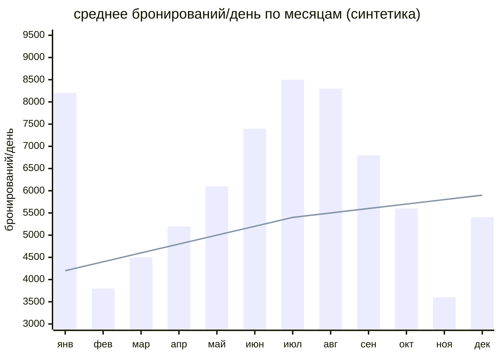
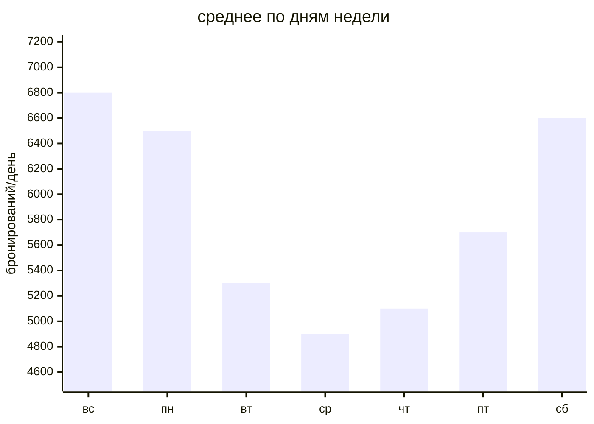
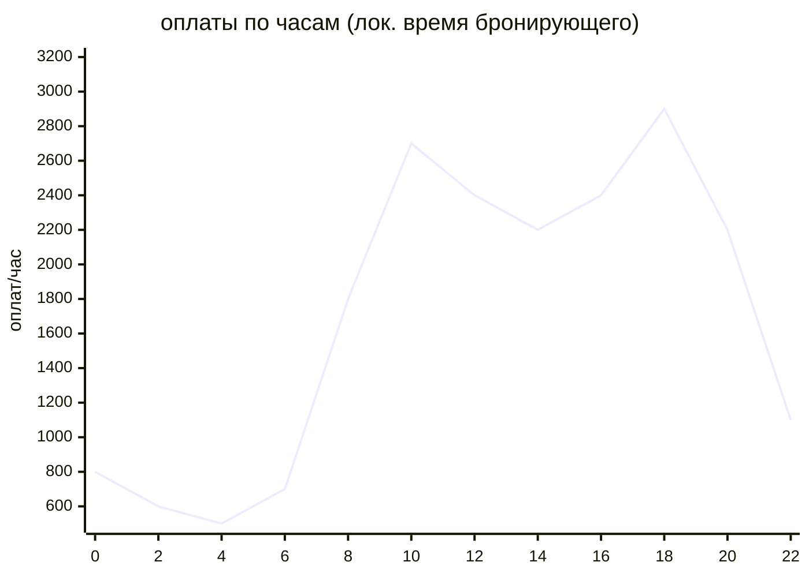
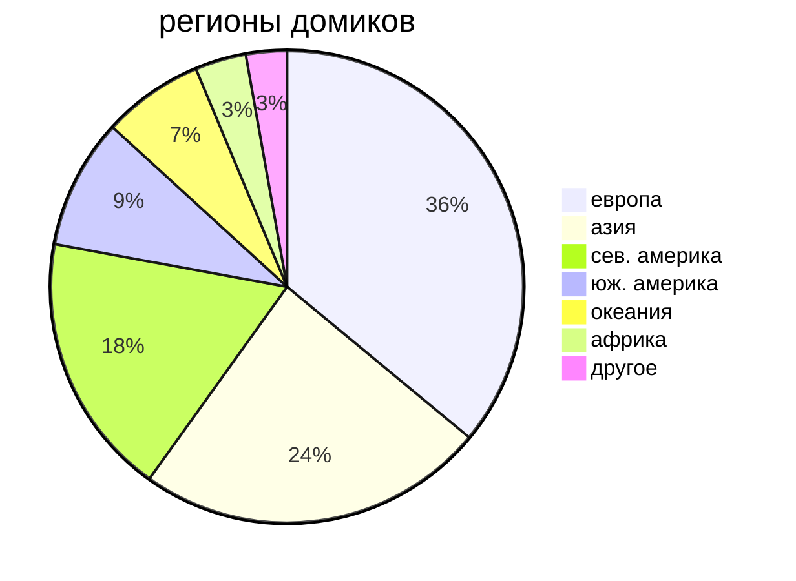
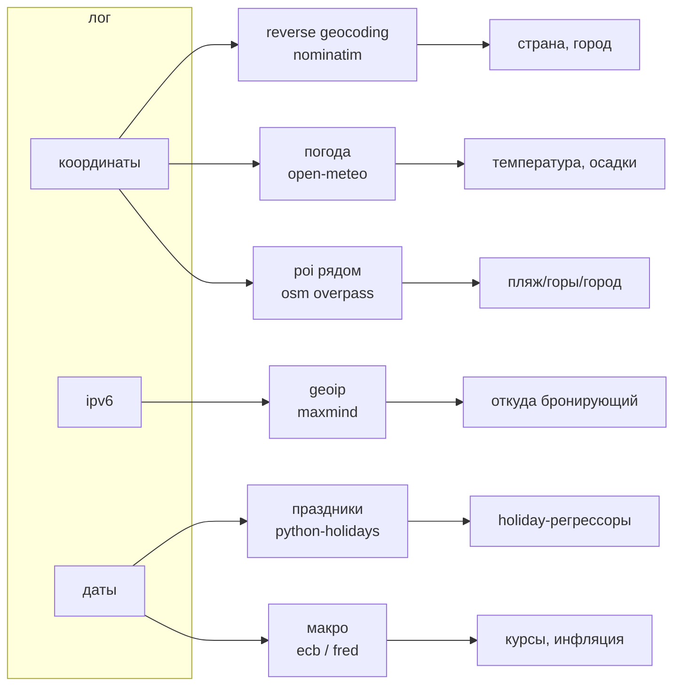
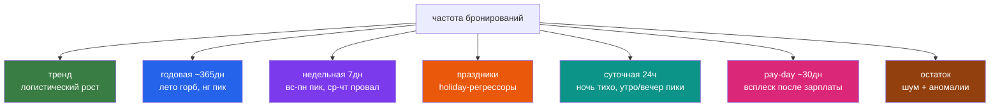

# bambuk take-home

take-home задание на аналитика в «Бамбук» (сервис бронирования загородных домиков).

лог на 6кк+ бронирований за 2023-2025, поля через `;`

## что где

1. regex для разбора строк — `regex.py`
2. контрольный сет — `generator.py`
3. внешние данные для обогащения — `enrichment.md` + `enrichment.py`
4. компоненты частоты бронирований — `timeseries.md`

всё вместе — `bambuk_interview.ipynb`

## запуск

```bash
pip install -r requirements.txt
python generator.py               # -> sample_bookings.csv
python enrichment.py --dry-run    # без реальных запросов
```

---

## визуализация

### годовая сезонность

лето — широкий горб, новый год — острый пик, ноябрь и февраль проседают



### недельная сезонность

пик вс-пн (планируют на выходных), провал ср-чт



### суточная ритмика

ночью не бронируют, утренний пик ~10:00, вечерний ~19:00



### география домиков

после обогащения reverse geocoding



### обогащение — откуда что берём



### декомпозиция временного ряда


